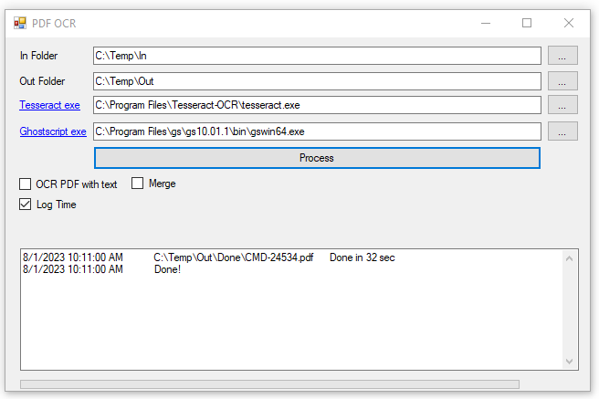

# Searchable PDF App

Originally posted here:
<https://www.codeproject.com/Articles/5365904/Searchable-PDF-App/>

This tool will convert image and PDF files to searchable PDFs.

## Introduction
This tool is using Tesseract to do the OCR (Optical Character Recognition). The tool is also using Ghostscript to convert non-searchable PDFs to TIFF files so that can be converted to searchable PDFs. The tool also provides an option to merge converted PDF files into one.

The tool is using iTextSharp library to see if the PDF is searchable or not. The following image files are supported: BMP, PNM, PNG, JFIF, JPEG, JPG, TIFF, TIF, GIF, PDF

1. OCR PDF with text option will OCR PDF files regardless of whether they are already searchable or not
2. Merge - option to merge converted PDF files into one searchable PDF
3. Log Time - show time it takes to process each file

First, install Tesseract and Ghostscript. Next, select Tesseract.exe and GsWin64.exe locations in the tool. Finally, select input and output folders and click Process.

## Using the Code
- ProcessFile() is the key function that will OCR file and convert it based to PDF based on the file type. The key part of this function is RunDosCommandAsynch().
- PdfToTiff uses ghost script to convert non-searchable PDF to TIFF. It is the secret to converting non-searchable PDFs to searchable PDFs.
- RunDosCommandAsync()h does the action of running DOS command.
- PdfHasText() function uses iTextSharp library to see if the PDF is searchable or not.
- Merge() function uses iTextSharp library to merge PDF files.

## Bonus VBS (For Processing PDF Files in Parallel)
As a bonus, I included a PdfOcr.vbs VB Script file that will convert a folder or a file to searchable PDF if you drag-and-drop folder or file on it. The advantage of using the approach is that you can process many PDF/image files in parallel. This way, only files that do not have corresponding searchable PDF will be processed. You should be able to run this on one server or on many servers running against same folder or file share.

Make sure that Tesseract and Ghostscript are installed. Next, make sure that sGhostscriptPath (line 7) and sTesseractPath (Line 8) point to location of Tesseract.exe and GsWin64.exe files.

- OcrImgFile sub does processing of the image files to searchable PDFs.
- OcrPdfFile sub converts non-searchable PDFs to searchable PDFs.
